<script type="text/javascript"
  src="https://cdn.mathjax.org/mathjax/latest/MathJax.js?config=TeX-AMS-MML_HTMLorMML">
</script>
# Introduction to git

BB1000 Programming in Python

KTH

---

layout: false

## Learning objectives

* What version control is

* Why we should use version control

* Why we choose use git

- Know about the basic components in git
    + work directory
    + staging area
    + repository (local, remote)
    + branches

* Know commands for basic git workflow
    - How to save history
    - How to undo mistakes
    - How to collaborate with others (github)

---
## What is version control:
-

* A Version Control System (VCS) is a frameorks that tracks the history of a project

* The history of a project is a sequence of versions

* At any point in time we can go back to a previous version

* A VCS allows you to compare different versions

* A VCS allows several users to work on the same project files simultaneously
---

## Why use version control

You may already have used some manual version...

```
$ cp -r Project Project.save
```
... work 
```
$ cp -r Project Project.save.v2
```
... work 
```
$ cp -r Project Project.save.v2.new
```
---
<center>

</center>

---

## Introducing git

<center>

</center>


* Written by Linus Thorvalds, originally for the Linux kernel
* A distributed Version Control System
* Several servers have all information
* Any one can be chosen as the reference version
* One of the most popular frameworks today (others: bazaar, mercurial)

* Historical frameworks (subversion, CVS, RCS)

---

## When to use

#### Why

* For source code development
* For manuscripts
* In single-user projects
* In collaborative projects

`Practically always`

#### Benefits

* No history is lost
* All versions of your documents are preserved
* Easy to backup to other sites


---

# Concepts

* Work directory: local directory where you work
* Cache: temporary area for files you intend to keep
* Commit: a snapshot of the project files at a point in time
* Repository: sequence/tree of commits (history of the project)

# 11 basic commands

<div class="col-md-6">
    <ul>
        <li>Initialize</li>
        <ul>
        <li>clone</li>
        <li>init</li>
        </ul>
        <li>Queries</li>
        <ul>
        <li>status</li>
        <li>log </li>
        <li>diff</li>
        </ul>
    </ul>
</div>
<div class="col-md-6">
    <ul>
        <li>Changing locally</li>
        <ul>
        <li>add </li>
        <li>commit</li>
        <li>merge</li>
        </ul>
        <li>Remote interaction</li>
        <ul>
        <li>push</li>
        <li>fetch</li>
        <li>pull</li>
        </ul>
    </ul>
</div>


---

### Setup

#### The first time around
```
    $ git config --global user.name "First Last"
    $ git config --global user.email "first.last@isp.com"
```

Creates a configuration file ``~/.gitconfig``
```
    [user]
	name = First Last
	email = first.last@isp.com

```
*Note*:    You can create and edit the file directly

---

### Initializing a repository

* Use an existing directory or create a new project directory
```
    $ mkdir proj
```
<pre>
proj/
</pre>

* Go to the directory and initialize
```
    $ cd proj
    $ git init
    Initialized empty Git repository in (...)proj/.git/
```
<pre>
proj/
└── .git
</pre>

---
<pre>
proj/
└── .git
</pre>

## Check status

* Check repository status

```
$ git status
On branch master

Initial commit

nothing to commit (create/copy files and use "git add" to track)
```
---

<pre>
proj
├── .git
└── hello.py
</pre>

## Create a new file

```python
#hello.py
print("Hello world!")
```

* Recheck status - Git warns about **untracked** files

```
$ git status
On branch master

Initial commit

Untracked files:
  (use "git add <file>..." to include in what will be committed)

                                                                                        hello.py

nothing added to commit but untracked files present (use "git add" to track)
```


---

<pre>
proj
├── .git
└── hello.py
</pre>

## Add file to Git

```
$ git add hello.py
$ git status
On branch master

Initial commit

Changes to be committed:
  (use "git rm --cached <file>..." to unstage)

    new file:   hello.py
```


### The staging area/cache
* After an add operation a file is in the staging area (cache)
* This is an intermediate level between the work directory and repository

---
<pre>
proj
├── .git
└── hello.py
</pre>

## Save to repository
* Save the latest changes in the local repository (in `.git` directory)
```
$ git commit -m "First hello"
[master (root-commit) edf197e] First hello
 1 file changed, 1 insertion(+)
 create mode 100644 hello.py
```
* Check status - all clear
```
$ git status
On branch master
nothing to commit, working directory clean
```

---

### Review history

To see the commit history of the project files
```
$ git log --oneline
f56e3da (HEAD -> master) First hello
```

<center>

</center>

* A branch is viewed as a line of a development
* Initial default branch is always `master`
* A branch in practise a label for a particular commit
* HEAD is an alias for the current active branch

---


### Viewing changes

* Consider a modified file

```python
#hello.py
print("Hello there world!")
```
* git now recognizes this tracked file as modified

```
$ git status
On branch master
Changes not staged for commit:
  (use "git add <file>..." to update what will be committed)
  (use "git checkout -- <file>..." to discard changes in working directory)

                                                                                        modified:   hello.py

no changes added to commit (use "git add" and/or "git commit -a")
```
---

### Viewing changes

```
$ git diff
diff --git a/hello.py b/hello.py
index ed708ec..01c97be 100644
--- a/hello.py
+++ b/hello.py
@@ -1 +1 @@
-print("Hello world!")
+print("Hello there world!")
```
---

### Save changes

* First to cache

```bash
$ git add hello.py
$ git status
On branch master
Changes to be committed:
  (use "git reset HEAD <file>..." to unstage)


	modified:   hello.py
```

* then to repository

```bash
$ git commit -m "Change greeting"
[master f7efe62] Change greeting
 1 file changed, 1 insertion(+), 1 deletion(-)
```
---

### History after two commits


```bash
    $ git log --oneline
b895711 (HEAD -> master) Change greeting
f56e3da First hello
```

<center>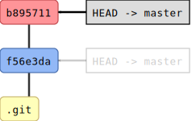</center>

---


### Recovering old work
* To retreive old verions, use checkout with the commit string

```
$ git checkout f56e3da
Note: checking out 'f56e3da'.

You are in 'detached HEAD' state. You can look around, make experimental
changes and commit them, and you can discard any commits you make in this
state without impacting any branches by performing another checkout.

If you want to create a new branch to retain commits you create, you may
do so (now or later) by using -b with the checkout command again. Example:

  git checkout -b <new-branch-name>

HEAD is now at f56e3da... First hello
```

```
$ cat hello.py
print("Hello world")!
```
---

```
$ git log --oneline --all
b895711 (master) Change greeting
f56e3da (HEAD) First hello
```

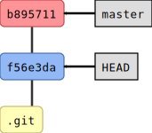

```
$git checkout master
Previous HEAD position was f56e3da... First hello
Switched to branch 'master'
```
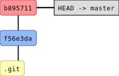

---

### The work cycle
There are three levels, from "lowest"

* The work directory
* The staging area
* The repository


```
repository (c1 -> c2 -> c3...)
    ^
    |   commit #save permanently in repository

staging area (cache)

    ^
    |   add  #adds new file or saves latest changes

work directory
```

A single file represented att all levels and all previous versions

---

## Branches

```
$ git branch in-more-languages
$ git checkout in-more-languages 
Switched to branch 'in-more-languages'
```
```
$ git log --oneline --all
b895711 (HEAD -> in-more-languages, master) Change greeting
f56e3da First hello
```
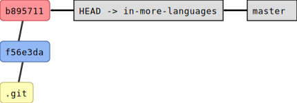

---
### Work in the new branch

```python
#hello.py
print("Hello there world!")
print("Bonjour tout le monde!")
```

```
$ git add -u 
$ git commit -m "French"
[in-more-languages 84bfae8] French
 1 file changed, 1 insertion(+)
```

```
$ git log --oneline
84bfae8 (HEAD -> in-more-languages) French
b895711 (master) Change greeting
f56e3da First hello
```
<center>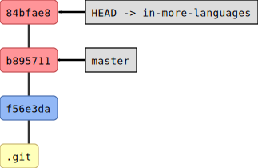</center>

---

### Keep the changes: merge to master

```
$ git checkout master
Switched to branch 'master'
```
<center>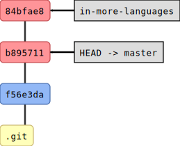</center>

---

* Incorporate the changes from the `in-more-languages` branch

```
$ git merge in-more-languages 
Updating b895711..84bfae8
Fast-forward
 hello.py | 1 +
 1 file changed, 1 insertion(+)
```
<center>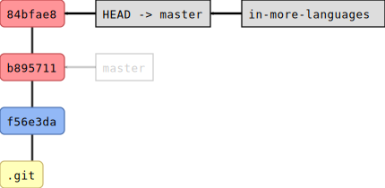</center>

---

* If the old branch is not needed it may be deleted

```
$ git branch -d in-more-languages 
Deleted branch in-more-languages (was 84bfae8).

```
<center>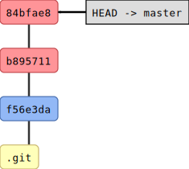</center>


* Note: the branch concept brings to mind a certain line of development, like the
branch of a tree. However a git branch name essentially a label for a
particular commit. If one commit has two labels one of them can easily be
deleted without loosing any information.

---

## Remote repositories

* Necessary for collaborative projects
* Useful for single-user projects
* Web-services, github, bitbucket
* A shared directory (NFS, AFS, Dropbox....)
* git pull from remote
* git push to remote

```
repository (.git)  <->   remote
                pull,push

    ^
    |   commit

staging area (cache)

    ^
    |   add

work directory     <- init, clone
```

---

## Working with KTH github

* See https://www.kth.se/student/kth-it-support/work-online/kth-github
* Go to https://gits-15.sys.kth.se and log in with your KTH account
* You need to upload ssh keys for this service

---

### Uploading a local repository

* Having logged in create a new empty repository in the browser
* Locally define an alias for the new remote repository:
any name will do but *origin* is a common convention
```
$ git remote add origin git@gits-15.sys.kth.se:<user>/proj
```
```
$ git remote -v
origin git@gits-15.sys.kth.se:<user>/proj (fetch)
origin git@gits-15.sys.kth.se:<user>/proj (push)
```
* push the local to the remote, and let the local branch track the remote repository
```
$ git push --set-upstream origin master
...
To git@gits-15.sys.kth.se
 * [new branch]      master -> master
Branch master set up to track remote branch master from origin.
$ git branch -vv
 * master 84bfae8 [origin/master] French
```
---

### Remote repository(origin)


After the push operations the remote repository  has the same information as
the local

### Local repository

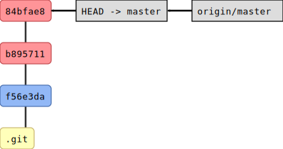

In local repository also have knowledge about the status of the remote
repositry in terms of an extra branch name `origin/master`

---

### Continue work on another computer

* get a copy of the repository

```
    |Other> git clone git@gits-15.sys.kth.se:<user>/proj.git
    Cloning into 'proj'...
    done.
    |Other> cd proj
```
* work on other computer and push back changes
    - edit -> add -> commit -> push

---

### On other computer

```
|other> git commit
```

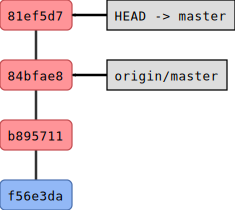

```
|other> git push
```

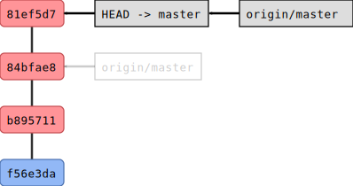

---

### Back on local computer

* Retrieve changes that was made on another system


```
$ git fetch  # obtain new remote commits but do not change anything locally
```

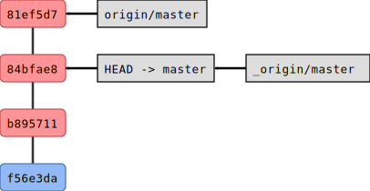

---

```
$ git pull # does a fetch and a merge to your local repository
```
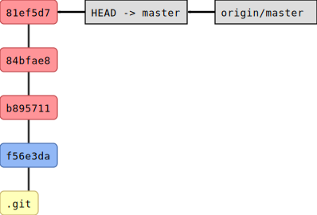
---

### Summary of work cycle

* Start a new project
```
    $ git init
```

* Get a copy of existing project
```
    $ git clone
```

* Locally: edit-add-commit
```
    $ vim ...
    $ git add...
    $ git commit...
```
* Sync with remote: pull-push
```
    $ git pull
    $ git push
```

---
## Github collaborative workflow
Contributing to open source

* In the web interface of the reference repo, fork a copy to your own account
* Clone from your copied repository to your work space. By default your fork
will have now have remote label 'origin'
* It is customary to define the reference repo with the remote label "upstream"
```
$ git remote add upstream <url of reference repo>
```
* Retrieve the current information from the reference repo
```
$ git fetch upstream
```
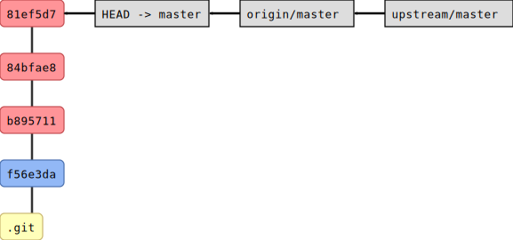

---
* Create and checkout a 'fix' branch for a particular change
```
$ git checkout -b fix
```
* Edit the file, add and commit locally
```
$ git add .
$ git commit -m "This is my fix"
```
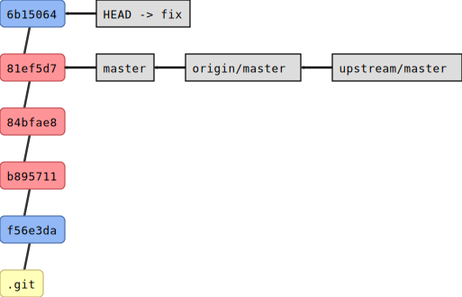

---
* Push the fix branch to your copy repo
```
$ git push origin fix
```
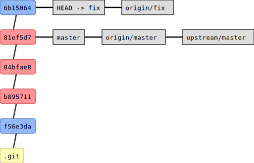

* Now you are ready to do a pull request in the Github web interface

---

### Links

* http://git-scm.com/book
* http://swcarpentry.github.io/git-novice/
* http://www.linux.com/news/featured-blogs/185-jennifer-cloer/821541-10-years-of-git-an-interview-with-git-creator-linus-torvalds
* https://gun.io/blog/how-to-github-fork-branch-and-pull-request/
* https://www.linux.com/learn/fixing-mistakes-git
* http://christoph.ruegg.name/blog/git-howto-revert-a-commit-already-pushed-to-a-remote-reposit.html
* http://git-man-page-generator.lokaltog.net/

### Acknowledgement

* Figures produced with gitink software by Radovan Bast
